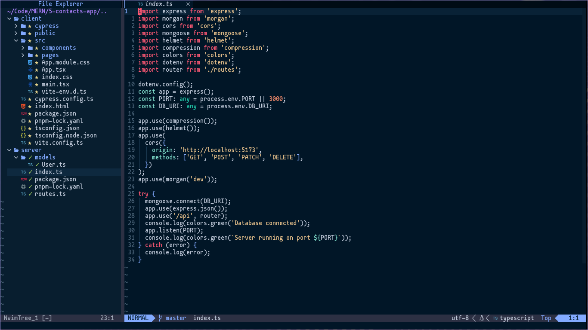

# My NeoVim Rice



## Setup
### Clone the repo
```sh
git clone https://github.com/martinval11/neovim-config
```

### NeoVim Setup
First, you need to install Vim Plug, you can install it <a href="https://github.com/junegunn/vim-plug">here</a>
```sh
cd neovim-config
nvim init.vim
# NeoVim Commands Below
:source init.vim
:PlugInstall
```